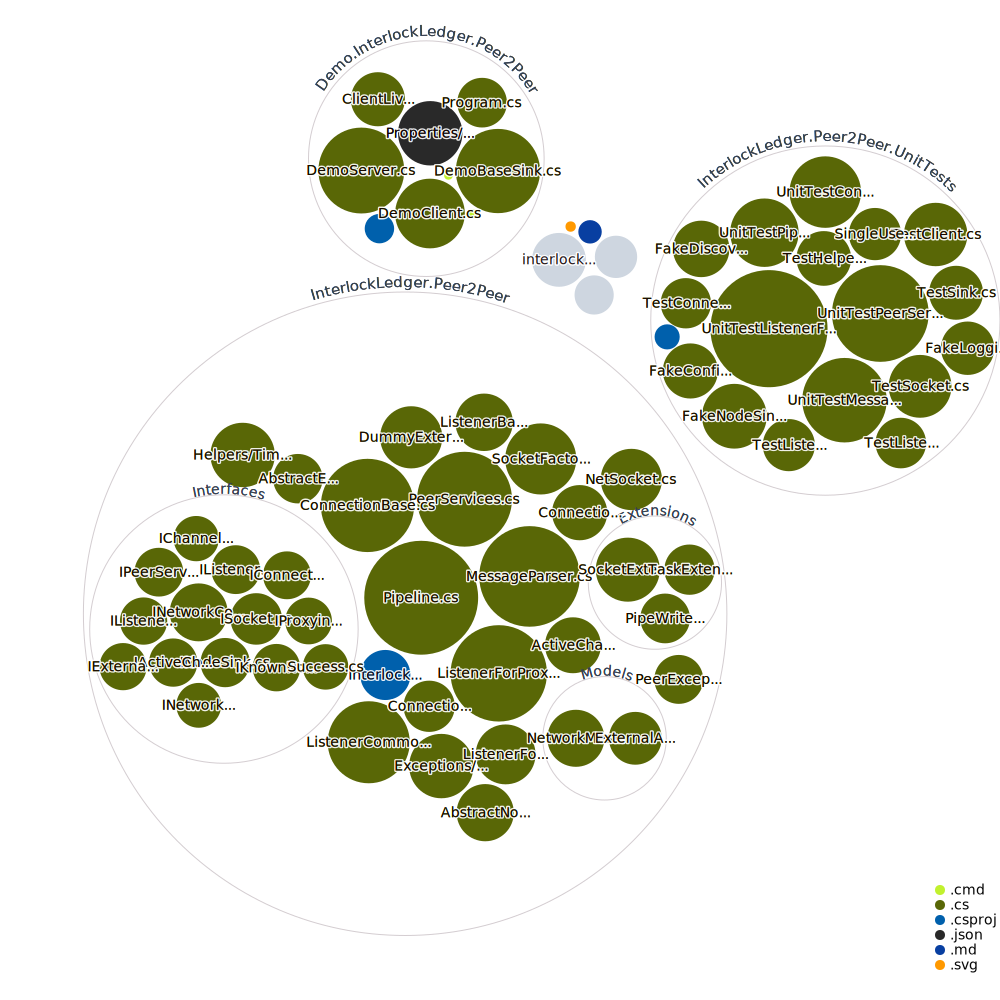

# InterlockLedger.Peer2Peer Library

This library implements the backbone of a P2P network in .NET, with peer discoverability and routing.
Plug your network protocol and defaults into it to have a working node.

**Version 2.0.0** now is **netstandard2.1** and requires .NET Core 3.1 LTS

